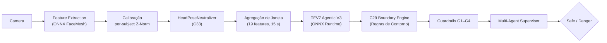

# DeteccaoFadiga

Sistema de detecção de fadiga em tempo real baseado em visão computacional e
aprendizado de máquina. Analisa o rosto do motorista/operador via câmera,
extrai indicadores oculares e de postura, e classifica o estado como
**Safe** ou **Danger** usando uma rede MLP executada em ONNX Runtime.

Projetado para rodar em **Raspberry Pi** (com AI Camera IMX500) ou em
**PC/notebook** com webcam USB.

## Arquitetura



### Camadas do pipeline

| Etapa | Arquivo | Descrição |
|-------|---------|-----------|
| Extração de features | `feature_extractor_rt.py` | ONNXFaceMeshBackend → EAR, MAR, head pose (pitch/yaw/roll) |
| Calibração | `subject_calibrator_rt.py` | Warm-up de 120 s, seleciona melhor segmento de 30 s (maior EAR médio), calcula baseline Z-Norm por sujeito |
| Neutralização de pose | `run_realtime_demo.py` | HeadPoseNeutralizer (C33): zera pitch/yaw/roll/pitch_std após scaler para classificação agnóstica a pose |
| Janela de features | `window_factory_rt.py` | Janela deslizante de 15 s → 19 features agregadas |
| Inferência | `model_loader.py` | TEV7 Agentic V3 (ONNX), SelectiveScaler via JSON, threshold 0.41 |
| Regras de contorno | `c29_boundary_engine.py` | C29: 4 regras sobre head pose (R1 override, R2–R4 boosts) |
| Guardrails | `guardrails.py` | G1 saída estruturada, G2 ranges fisiológicos, G3 rate-limit/watchdog, G4 validação de calibração |
| Multi-Agent | `agents.py` | OcularAgent, BlinkAgent, PosturalAgent + SupervisorAgent |
| Reflection | `reflection.py` | DriftReflector, PredictionReflector, AutoRecalibrationManager |
| Memória | `memory.py` | SessionMemory (RAM), OperatorStore (SQLite), FeatureLogger (CSV) |
| Paralelização | `parallel.py` | FrameGrabber, PipelineWorker, PerformanceMonitor |
| Loop principal | `run_realtime_demo.py` | Captura → extração → calibração → janela → inferência → display/overlay |

## Estrutura do projeto

```
DeteccaoFadiga/
├── SALTE_INFERENCE/
│   ├── __init__.py
│   ├── feature_extractor_rt.py
│   ├── subject_calibrator_rt.py
│   ├── window_factory_rt.py
│   ├── model_loader.py
│   ├── run_realtime_demo.py
│   ├── offline_eval.py
│   ├── agents.py
│   ├── guardrails.py
│   ├── memory.py
│   ├── parallel.py
│   ├── reflection.py
│   ├── c29_boundary_engine.py
│   └── tests/
├── MODELS/
│   ├── best_model.onnx
│   ├── best_model.onnx.data
│   ├── blazeface_detector.onnx
│   ├── face_mesh_landmark.onnx
│   ├── inference_config.json
│   ├── c29_boundary_config.json
│   └── tev7_agentic_v3_summary.json
├── requirements.txt
└── README.md
```

## Requisitos

- **Python** 3.10+
- Dependências principais (ver `requirements.txt`):

| Pacote | Versão mínima |
|--------|---------------|
| numpy | 1.24 |
| opencv-python-headless | 4.8 |
| onnxruntime | 1.18 |

Opcionais:

- **picamera2** — necessário apenas no Raspberry Pi com AI Camera IMX500.
- **PyTorch** — necessário apenas para `offline_eval.py`.

## Instalação

```bash
git clone https://github.com/euBrunoMelo/DeteccaoFadiga.git
cd DeteccaoFadiga
pip install -r requirements.txt
```

## Como usar

### Webcam USB (PC / notebook)

```bash
python -m SALTE_INFERENCE.run_realtime_demo \
    --model-dir MODELS
```

### Raspberry Pi + AI Camera IMX500

```bash
python -m SALTE_INFERENCE.run_realtime_demo \
    --model-dir MODELS \
    --picamera --headless
```

### Com tracking de operador e features paralelas

```bash
python -m SALTE_INFERENCE.run_realtime_demo \
    --model-dir MODELS \
    --operator-id bruno \
    --parallel \
    --log-features
```

### Parâmetros CLI

| Parâmetro | Padrão | Descrição |
|-----------|--------|-----------|
| `--model-dir` | `MODELS` | Diretório com todos os arquivos de modelo |
| `--model` | `{model-dir}/best_model.onnx` | Caminho explícito do modelo ONNX |
| `--config` | `{model-dir}/inference_config.json` | Caminho da configuração de inferência |
| `--detector-model` | `{model-dir}/blazeface_detector.onnx` | Detector de face |
| `--mesh-model` | `{model-dir}/face_mesh_landmark.onnx` | Landmarks faciais |
| `--threshold` | lido do config (0.41) | Sobrescreve o limiar de decisão |
| `--picamera` | off | Usa picamera2 (CSI / IMX500) |
| `--camera-index` | 0 | Índice da webcam USB |
| `--headless` | off | Sem janela de vídeo (para SSH sem X11) |
| `--warmup` | 120 s | Duração do warm-up para calibração |
| `--min-warmup` | 30 s | Tempo mínimo antes de permitir calibração forçada |
| `--fps` | 30 | FPS alvo |
| `--debug` | off | Imprime vetor de features (raw, scaled, neutralized) |
| `--no-neutralize-pose` | off | Desativa neutralização de head pose (modo lab / A/B test) |
| `--operator-id` | None | ID do operador para rastreamento e warm-start |
| `--parallel` | off | Captura em thread separada via FrameGrabber |
| `--log-features` | off | Grava features de cada janela em CSV para retraining |
| `--no-agents` | off | Desativa análise multi-agente (usa apenas MLP) |
| `--disable-c29` | off | Desativa todas as regras C29 de head pose |
| `--c29-override-only` | off | Apenas R1 (override), sem boosts R2–R4 |
| `--c29-log` | off | Loga avaliações C29 em `c29_alerts.jsonl` |

### Atalhos durante execução

- **c** — forçar calibração antes do fim do warm-up
- **q** — encerrar

## Modelo e métricas

**TEV7 Agentic V3** — MLP treinado com 19 features extraídas de vídeos faciais
(experimento TEV7, validação cruzada, ablation remove grupo Microsleep).

| Métrica | Valor |
|---------|-------|
| Balanced Accuracy | 71.5 % |
| Safe Recall | 79.5 % |
| Threshold | 0.41 |

### Features utilizadas (19)

`ear_mean`, `ear_std`, `ear_min`, `ear_vel_mean`, `ear_vel_std`,
`mar_mean`, `pitch_mean`, `pitch_std`, `yaw_std`, `roll_std`,
`blink_count`, `blink_rate_per_min`, `blink_mean_dur_ms`,
`perclos_p80_mean`, `perclos_p80_max`, `blink_closing_vel_mean`,
`blink_opening_vel_mean`, `long_blink_pct`, `blink_regularity`

> Nota: `microsleep_count` e `microsleep_total_ms` foram removidos por ablation
> (Grupo 8) mas ainda são computados pelo `window_factory_rt.py` para uso pelos
> agentes e guardrails.

## Multi-Agent Supervisor

O módulo `agents.py` implementa um padrão Supervisor com 3 agentes especialistas
que operam **em paralelo ao MLP**, fornecendo análise interpretável:

| Agente | Domínio | Tempo de reação |
|--------|---------|-----------------|
| `OcularAgent` | EAR + PERCLOS (microsleep iminente) | Segundos |
| `BlinkAgent` | Padrões de piscada (degradação progressiva) | Minutos |
| `PosturalAgent` | Head pose + MAR (bocejo) | Minutos |
| `SupervisorAgent` | Agrega opiniões (weighted avg + convergence boost) | — |

O Supervisor classifica o nível de fadiga em `SAFE / WATCH / DANGER / CRITICAL`
e identifica o tipo dominante: `ocular`, `behavioral`, `postural` ou `mixed`.

## C29 Boundary Engine

Camada adicional de regras sobre head pose, operando **sem alterar o modelo**:

| Regra | Condição | Ação |
|-------|----------|------|
| R1 | Activity drop sustentado > 30 s (após 5 min warm-up) | Override → Danger |
| R2 | Head stillness extrema > 20 s | Boost +0.15 |
| R3 | Pitch domina yaw + nodding energy elevada > 10 s | Boost +0.20 |
| R4 | Oscilação involuntária com baixa atividade (instantâneo) | Boost +0.25 |

Boosts são aditivos com cap em 0.40. Thresholds configuráveis via `c29_boundary_config.json`.

## Guardrails

| Camada | Componente | Função |
|--------|-----------|--------|
| G1 | `FatigueOutput` | Saída estruturada com validação automática |
| G2 | `_check_feature_ranges` | Verifica features dentro de ranges fisiológicos |
| G3 | `BehaviorGuardRails` | Rate limit de alertas (60 s cooldown), grace period pós-calibração, watchdog de 30 s |
| G4 | `validate_calibration` | Critérios fisiológicos: EAR ∈ [0.15, 0.40], yaw < 30°, pitch_std < 25° |

## Reflection (Auto-Correção)

| Componente | Função |
|-----------|--------|
| `DriftReflector` | Compara médias recentes vs training_stats a cada 10 janelas; detecta STABLE / WARNING / DRIFTED / CRITICAL |
| `PredictionReflector` | Detecta padrões anômalos: `oscillating`, `stuck_danger`, `sudden_transition` |
| `AutoRecalibrationManager` | Fecha o loop: decide quando acionar recalibração automática (cooldown de 5 min, max 4/hora) |

## Memória

| Componente | Storage | Função |
|-----------|---------|--------|
| `SessionMemory` | RAM | Estado completo da sessão (contadores, históricos, streaks) |
| `OperatorStore` | SQLite (`operator_memory.db`) | Perfis de operadores entre sessões; warm-start reduz warm-up de 120 s para 30 s |
| `FeatureLogger` | CSV | Grava 19 features por janela para retraining (opt-in via `--log-features`) |

## Constraints de design

| ID | Regra |
|----|-------|
| C5 | Z-Norm sempre per-subject (nunca global) |
| C6-V2 | Calibração pelo segmento de 30 s com maior EAR médio nos primeiros 120 s |
| C11 | Selective scaling — apenas features contínuas normalizadas, passthrough intactas |
| C13 | PERCLOS calculado sobre EAR cru (nunca Z-normalizado) |
| C21 | Velocidades expressas em EAR/s |
| C22 | Blink velocity limitada ao intervalo \[0.01, 5\] |
| C28 | Critério de aprovação do modelo (balanced accuracy) |
| C29 | Regras de contorno baseadas em head pose (R1–R4), aditivas, sem alterar modelo |
| C33 | HeadPoseNeutralizer: zera pitch/yaw/roll/pitch_std após scaler em produção |

## Licença

A definir.
